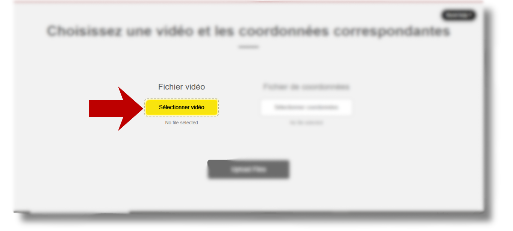
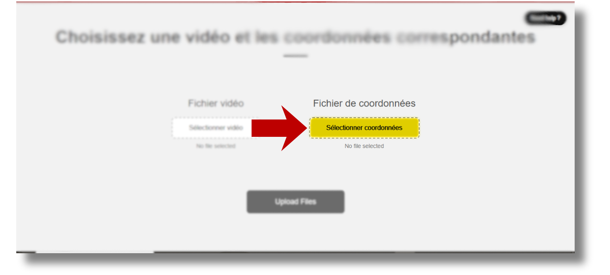
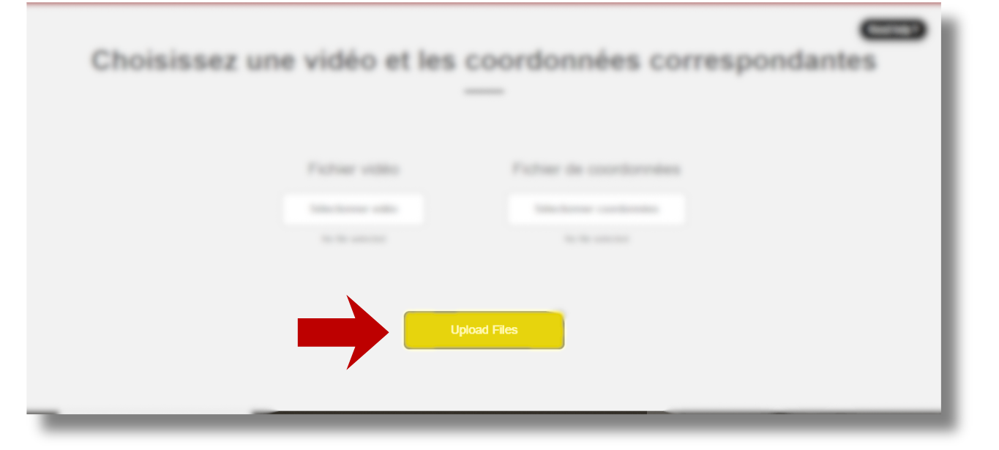
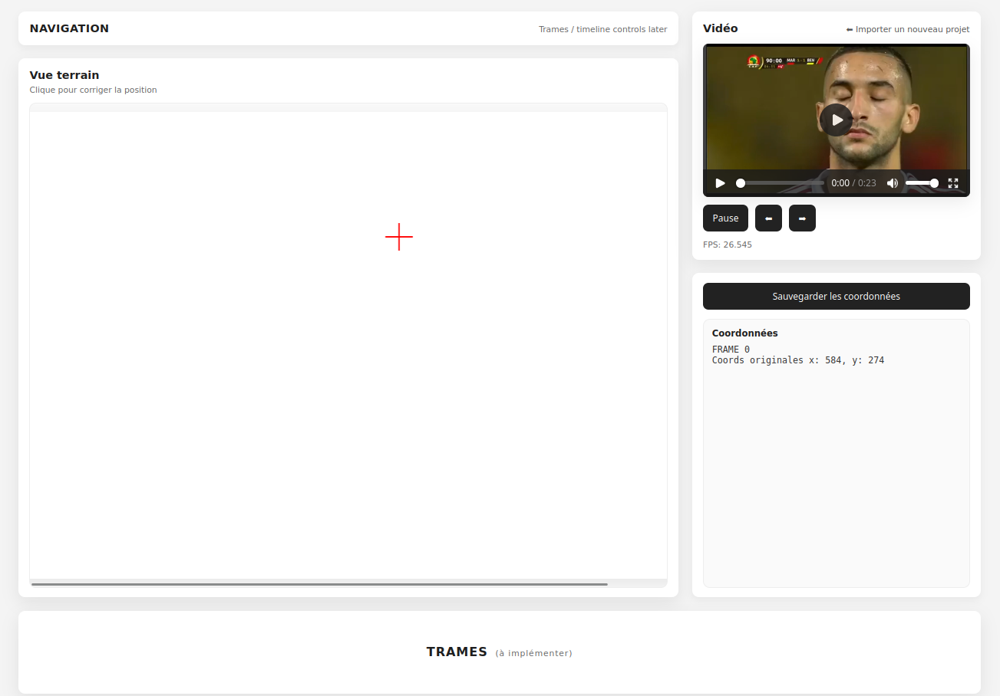
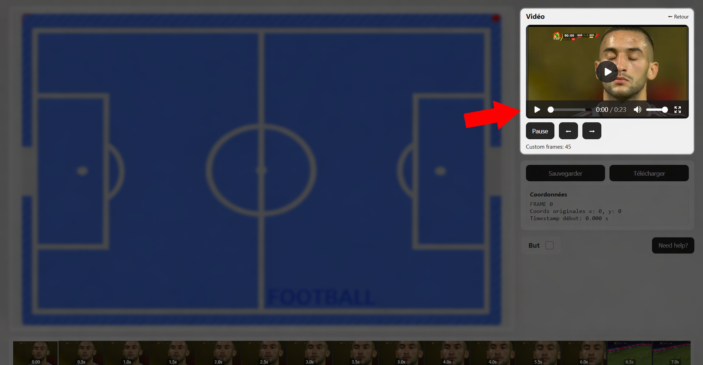
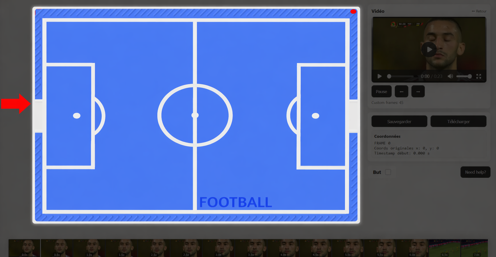
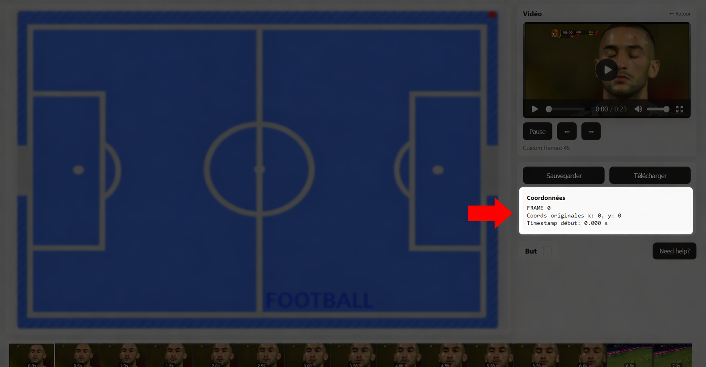
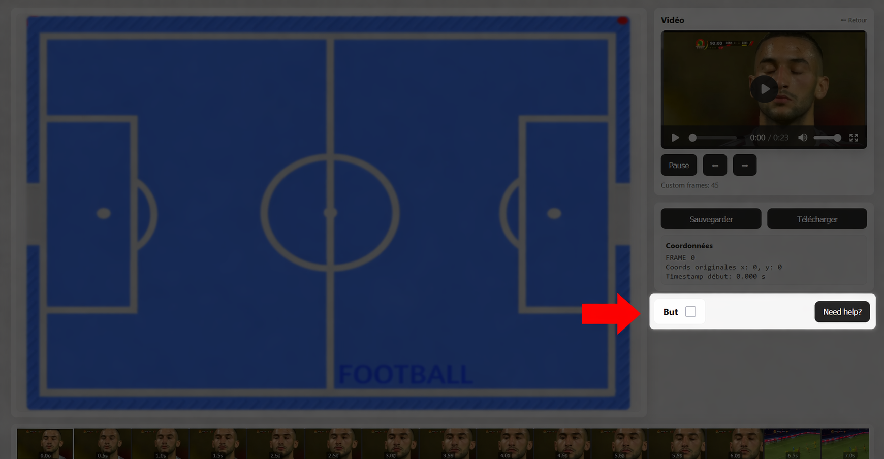

# NowYouCMe — Outil Démonstrateur Touch2See

Application web de correction des positions d'un ballon de football sur des matchs enregistrés, développée pour l'entreprise [Touch2See](https://www.touch2see.com).

## Contexte

Touch2See développe des tablettes tactiles permettant aux personnes malvoyantes et non-voyantes de suivre des matchs de football. Un aimant représentant le ballon se déplace sur la surface selon les coordonnées issues du match réel.

Ces coordonnées peuvent être erronées. L'outil développé dans ce dépôt permet aux employés de Touch2See de **visualiser une vidéo de match et ses coordonnées associées, puis de les corriger d'un simple clic**, avant d'exporter le fichier corrigé dans le format attendu par les tablettes.

## Équipe

Projet réalisé dans le cadre du Master Informatique — *Computer Science for Aerospace*, Université Toulouse III — Paul Sabatier.

- **Kehina Manseri** — Cheffe de projet, back-end
- **Nihal Rouabhi** — Référente technique, back-end
- **Duc-Hai Nguyen** — Front-end
- **Chu Hoang Anh Nguyen** — Front-end

**Client** : Frédéric Jenn Alet — Touch2See

## Stack technique

| Partie | Technologies |
|---|---|
| Backend | Python, Django 5.2, OpenCV (cvzone), SQLite |
| Frontend | React 19, TypeScript, Vite, React Router |

## Installation et lancement

### Prérequis
- Python 3.10+
- Node.js 18+ et npm

### Cloner le dépôt
```bash
git clone https://github.com/KehinaleK/NowYouCMe.git
cd NowYouCMe
```

### Backend — Django
```bash
# Depuis la racine du projet
python -m venv venv
source venv/bin/activate        # Linux / macOS
venv\Scripts\activate           # Windows

pip install -r requirements.txt
python manage.py migrate
python manage.py runserver
```
Backend accessible sur `http://localhost:8000`.

### Frontend — React + Vite
Dans un **second terminal** :
```bash
cd frontend
npm install
npm run dev
```
Frontend accessible sur l'URL affichée par Vite (par défaut `http://localhost:5173`).

## Guide d'utilisation

Un guide interactif est également disponible dans l'application via le bouton d'aide.

### 1. Fichier vidéo
Sélectionnez une vidéo pour commencer.



### 2. Fichier de coordonnées
Ajoutez le fichier de données (`.txt`) contenant les positions du ballon.



### 3. Lancer l'analyse
Cliquez sur le bouton **Upload** pour lancer la démonstration.



### 4. Interface de visualisation
Vous accédez à l'interface de visualisation avec le terrain et la vidéo côte à côte.



### 5. Lecteur vidéo
La vidéo importée est affichée ici avec les contrôles de lecture (play, pause, navigation).



### 6. Vue du terrain
Cette zone représente le terrain vu d'en haut. La **croix rouge** indique la position du ballon issue des données importées.



### 7. Correction manuelle
Cliquez sur le terrain pour ajuster manuellement la position du ballon sur la trame courante.


### 8. Coordonnées
Les coordonnées du ballon sont affichées ici et se mettent à jour en temps réel à chaque correction.



### 9. Marquer un but
Cochez la case **But** pour indiquer que la position de cette trame correspond à un but. Cette information est incluse dans le fichier de coordonnées lors du téléchargement.



## Structure du dépôt

```
NowYouCMe/
├── backend/          # API Django (traitement vidéo, gestion coordonnées)
├── frontend/         # Interface React + TypeScript (Vite)
│   └── public/images # Captures d'écran du guide
├── videos/           # Vidéos de test
├── manage.py         # Point d'entrée Django
└── requirements.txt  # Dépendances Python
```

## Licence

Projet académique — tous droits réservés aux auteurs et à Touch2See.